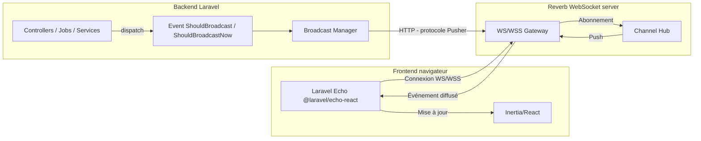
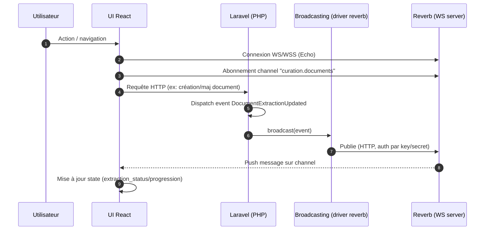

# Laravel Reverb (temps réel) — Mibeko Tableau de Bord

Ce projet utilise **Laravel Reverb** (serveur WebSocket) + **Laravel Broadcasting** (côté backend) + **Laravel Echo** (côté frontend) pour pousser des mises à jour en temps réel à l’interface.

## Vue d’ensemble

- **Reverb** : serveur WebSocket (accepte des connexions WS/WSS de navigateurs).
- **Broadcasting** : couche Laravel qui publie des événements vers un “broadcaster” (ici Reverb).
- **Echo (frontend)** : client JS qui se connecte au WebSocket et s’abonne à des channels.

Dans ce projet, l’UI de curation écoute le channel public `curation.documents` et réagit à l’événement `DocumentExtractionUpdated`.

- Backend (événement) : [DocumentExtractionUpdated.php](file:///Users/benji_mac/Desktop/Mibeko/mibeko/mibeko-tableau-de-bord/app/Events/DocumentExtractionUpdated.php)
- Frontend (abonnement) : [Curation/Index.tsx](file:///Users/benji_mac/Desktop/Mibeko/mibeko/mibeko-tableau-de-bord/resources/js/Pages/Curation/Index.tsx#L122-L149)
- Initialisation Echo : [app.tsx](file:///Users/benji_mac/Desktop/Mibeko/mibeko/mibeko-tableau-de-bord/resources/js/app.tsx#L9-L14)
- Config broadcasting : [broadcasting.php](file:///Users/benji_mac/Desktop/Mibeko/mibeko/mibeko-tableau-de-bord/config/broadcasting.php)
- Config reverb (serveur) : [reverb.php](file:///Users/benji_mac/Desktop/Mibeko/mibeko/mibeko-tableau-de-bord/config/reverb.php)

## Architecture (schéma)



## Cycle complet (séquence)



## Variables d’environnement (recommandées)

### 1) Activer Reverb côté Laravel (broadcast driver)

Dans ce projet, la config est prête (driver `reverb` présent dans [broadcasting.php](file:///Users/benji_mac/Desktop/Mibeko/mibeko/mibeko-tableau-de-bord/config/broadcasting.php#L33-L47)), mais `.env.example` met `BROADCAST_CONNECTION=log`.

Pour activer le temps réel, mettez :

```dotenv
BROADCAST_CONNECTION=reverb
```

### 2) Identifiants Reverb (app_id / key / secret)

Reverb définit une “application” avec des credentials côté serveur, dans [reverb.php](file:///Users/benji_mac/Desktop/Mibeko/mibeko/mibeko-tableau-de-bord/config/reverb.php#L70-L101). Exemple (local) :

```dotenv
REVERB_APP_ID=local
REVERB_APP_KEY=local
REVERB_APP_SECRET=local
```

### 3) Cible Reverb utilisée par Laravel pour publier

Ces variables sont utilisées par le driver broadcasting `reverb` et par la config “apps” de Reverb :

```dotenv
REVERB_HOST=127.0.0.1
REVERB_PORT=8080
REVERB_SCHEME=http
```

### 4) Paramètres d’écoute du serveur Reverb

Ces variables pilotent où **le serveur Reverb** écoute (voir [reverb.php](file:///Users/benji_mac/Desktop/Mibeko/mibeko/mibeko-tableau-de-bord/config/reverb.php#L29-L55)) :

```dotenv
REVERB_SERVER_HOST=0.0.0.0
REVERB_SERVER_PORT=8080
REVERB_SERVER_PATH=
```

### 5) Variables côté frontend (Vite) pour Echo

Le projet initialise Echo avec `configureEcho({ broadcaster: 'reverb' })` dans [app.tsx](file:///Users/benji_mac/Desktop/Mibeko/mibeko/mibeko-tableau-de-bord/resources/js/app.tsx#L9-L14). `@laravel/echo-react` auto-remplit la config Reverb à partir des variables Vite suivantes :

```dotenv
VITE_REVERB_APP_KEY=local
VITE_REVERB_HOST=127.0.0.1
VITE_REVERB_PORT=8080
VITE_REVERB_SCHEME=http
```

## Démarrer en local (développement)

### Étape A — Backend (HTTP)

Lancez l’application Laravel (par exemple) :

```bash
php artisan serve --host=0.0.0.0 --port=8000
```

### Étape B — Frontend (Vite)

```bash
npm install
npm run dev
```

### Étape C — Serveur Reverb (WebSocket)

Lancez le serveur WebSocket :

```bash
php artisan reverb:start
```

Si vous avez défini `REVERB_SERVER_HOST` / `REVERB_SERVER_PORT`, Reverb écoutera sur ces valeurs (voir [reverb.php](file:///Users/benji_mac/Desktop/Mibeko/mibeko/mibeko-tableau-de-bord/config/reverb.php#L31-L35)).

### Étape D — Queue worker (uniquement si besoin)

Dans ce projet, `DocumentExtractionUpdated` implémente `ShouldBroadcastNow` (donc émission immédiate, pas de queue). Si vous créez d’autres événements en `ShouldBroadcast` (asynchrone), lancez un worker :

```bash
php artisan queue:work
```

## “Créer” un événement broadcasté (pattern)

Le pattern utilisé par [DocumentExtractionUpdated](file:///Users/benji_mac/Desktop/Mibeko/mibeko/mibeko-tableau-de-bord/app/Events/DocumentExtractionUpdated.php) :

- `broadcastOn()` : choisit le channel (ex: `new Channel('curation.documents')`)
- `broadcastWith()` : définit le payload envoyé au frontend
- `ShouldBroadcastNow` : envoie immédiatement (sinon `ShouldBroadcast` => passe par la queue)

### Correspondance côté frontend

Dans [Curation/Index.tsx](file:///Users/benji_mac/Desktop/Mibeko/mibeko/mibeko-tableau-de-bord/resources/js/Pages/Curation/Index.tsx#L122-L149) :

- Abonnement : `window.Echo.channel('curation.documents')`
- Écoute : `.listen('DocumentExtractionUpdated', (e) => { ... })`

## Dépannage (checklist)

- **Rien ne se met à jour**
  - Vérifier `BROADCAST_CONNECTION=reverb` (sinon `log` ne pousse rien au WS).
  - Vérifier que Reverb tourne : `php artisan reverb:start`.
  - Vérifier les variables `VITE_REVERB_*` (client) et `REVERB_*` (server) : host/port/scheme cohérents.
- **Erreur 403 sur /broadcasting/auth**
  - Vous êtes sur un **private channel** : il faut une session/auth + CSRF et un `Broadcast::channel(...)` adapté dans [channels.php](file:///Users/benji_mac/Desktop/Mibeko/mibeko/mibeko-tableau-de-bord/routes/channels.php).
  - Le channel `curation.documents` ici est **public**, donc pas de `/broadcasting/auth`.
- **WS se connecte en boucle / mixed content**
  - En HTTPS, utilisez `VITE_REVERB_SCHEME=https` et un endpoint en **WSS**.
  - En local sans TLS, utilisez `http` + port 8080.

