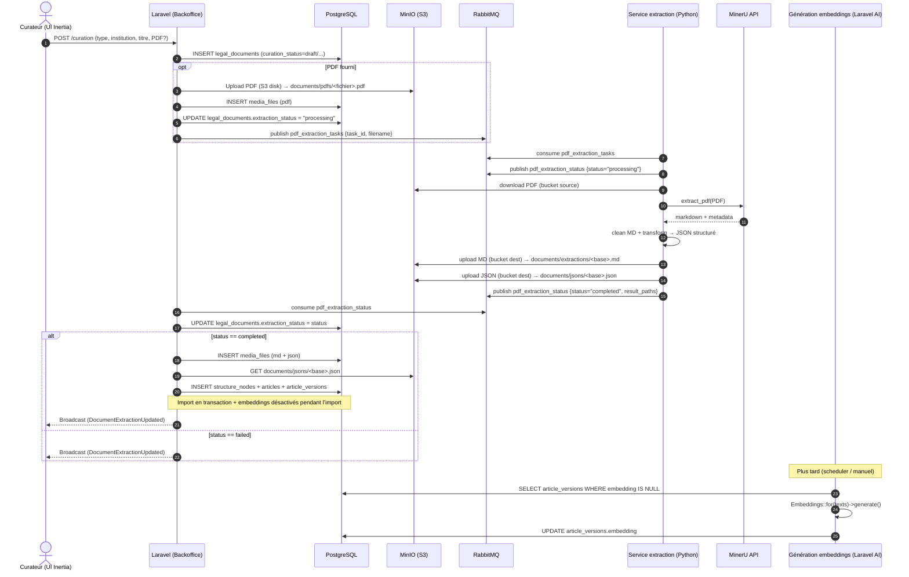
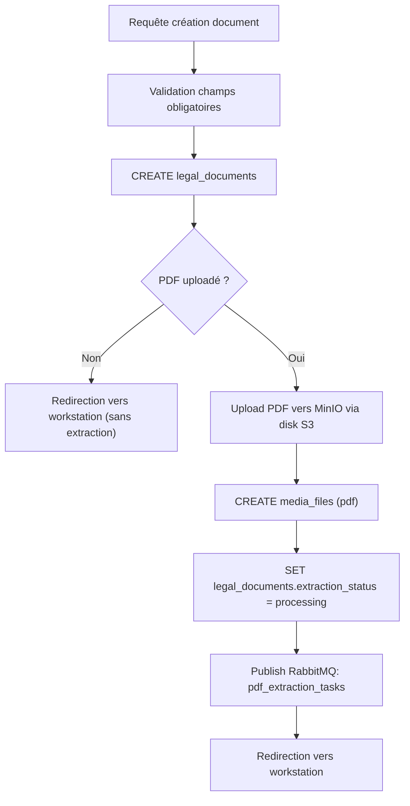
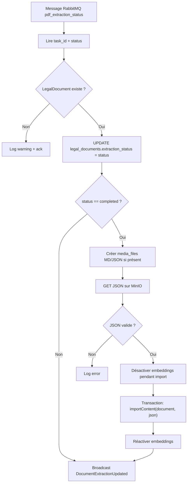
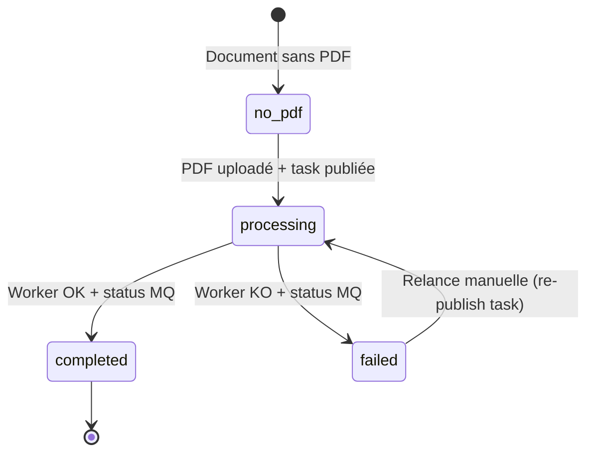
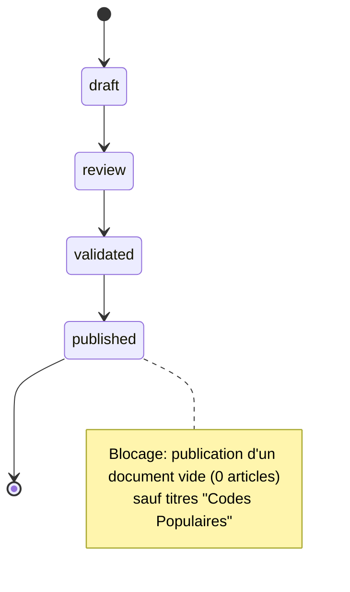
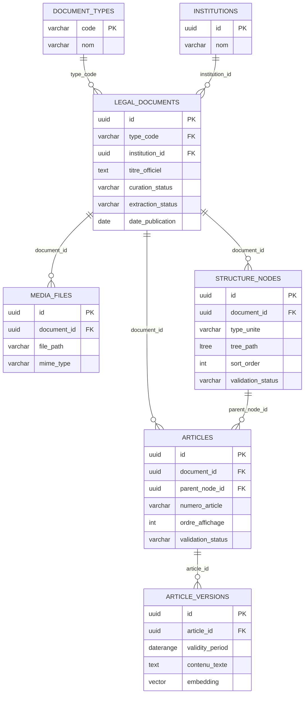

# Processus : création d’un document → extraction PDF → import DB → embeddings (RAG)

Ce document décrit, de bout en bout, ce qui se passe quand on crée un nouveau **LegalDocument** dans le backoffice Laravel, jusqu’à l’extraction PDF (service Python), l’import structuré en base (PostgreSQL), puis la génération des embeddings (RAG).

## Éléments obligatoires (et où ils vont)

### 1) Métadonnées du document (table `legal_documents`)

Lors de la création via le backoffice, l’endpoint de création valide au minimum :

- `type_code` (obligatoire) → `legal_documents.type_code` (FK vers `document_types.code`)
- `institution_id` (obligatoire) → `legal_documents.institution_id` (FK vers `institutions.id`)
- `titre_officiel` (obligatoire) → `legal_documents.titre_officiel`
- `curation_status` (obligatoire, enum) → `legal_documents.curation_status` (`draft|review|validated|published`)

Optionnel :

- `reference_nor` → `legal_documents.reference_nor`
- `date_publication` → `legal_documents.date_publication`
- `file` (PDF) → stockage MinIO + ligne dans `media_files`

Référence code : [CurationController.php](file:///Users/benji_mac/Desktop/Mibeko/mibeko/mibeko-tableau-de-bord/app/Http/Controllers/CurationController.php)

### 2) Fichiers média (table `media_files`)

Un document peut avoir plusieurs fichiers rattachés :

- PDF original (upload) : `mime_type = application/pdf`
- Markdown extrait : `mime_type = text/markdown`
- JSON structuré : `mime_type = application/json`

`media_files.file_path` contient un chemin objet S3/MinIO (ex: `documents/pdfs/...` ou `documents/jsons/...`).

Référence schéma : [pgsql-schema.sql](../database/schema/pgsql-schema.sql)

## Contrats d’échange (RabbitMQ)

### File “tâches” (Laravel → Worker extraction)

Queue : `pdf_extraction_tasks`\
Payload :

```json
{
  "task_id": "<uuid du legal_documents.id>",
  "filename": "<chemin objet MinIO du PDF>"
}
```

Références :

- Publication Laravel : [CurationController.php](file:///Users/benji_mac/Desktop/Mibeko/mibeko/mibeko-tableau-de-bord/app/Http/Controllers/CurationController.php#L81-L127)
- Consommation Worker : [worker.py](file:///Users/benji_mac/Desktop/Mibeko/mibeko/mibeko-extraction/app/worker.py#L123-L176)

### File “statuts” (Worker extraction → Laravel)

Queue : `pdf_extraction_status`\
Payload :

```json
{
  "task_id": "<uuid du legal_documents.id>",
  "status": "processing|completed|failed",
  "message": "<texte libre>",
  "result_paths": {
    "markdown": "documents/extractions/<base>.md",
    "json": "documents/jsons/<base>.json",
    "bucket": "<bucket destination>"
  }
}
```

Références :

- Publication Worker : [rabbitmq\_client.py](file:///Users/benji_mac/Desktop/Mibeko/mibeko/mibeko-extraction/app/services/rabbitmq_client.py#L51-L83)
- Consommation Laravel : [ConsumeExtractionStatus.php](file:///Users/benji_mac/Desktop/Mibeko/mibeko/mibeko-tableau-de-bord/app/Console/Commands/ConsumeExtractionStatus.php#L34-L118)

## Vue globale (diagramme de séquence)



## Détail : création côté Laravel (flowchart)



Point clé : sans PDF, le document existe mais il n’y a pas de pipeline d’extraction automatique déclenché.

Référence : [CurationController.php](file:///Users/benji_mac/Desktop/Mibeko/mibeko/mibeko-tableau-de-bord/app/Http/Controllers/CurationController.php#L81-L127)

## Détail : consommation des statuts + import structuré (flowchart)



Références :

- Consommation + import : [ConsumeExtractionStatus.php](file:///Users/benji_mac/Desktop/Mibeko/mibeko/mibeko-tableau-de-bord/app/Console/Commands/ConsumeExtractionStatus.php#L34-L118)
- Import JSON → tables : [DocumentImportService.php](file:///Users/benji_mac/Desktop/Mibeko/mibeko/mibeko-tableau-de-bord/app/Services/DocumentImportService.php)
- Skip embeddings (bulk import) : [ArticleVersionObserver.php](file:///Users/benji_mac/Desktop/Mibeko/mibeko/mibeko-tableau-de-bord/app/Observers/ArticleVersionObserver.php#L11-L31)

## Contrat JSON d’extraction (ce que Laravel sait importer)

Laravel sait importer plusieurs formes, mais le service Python produit principalement une structure de type :

- racine : `{"textes": [...]}`
- chaque texte contient : `numero_texte`, `intitule_long`, `contenu`
- `contenu` est une hiérarchie de divisions (Titre/Chapitre/Section/...) et d’articles

Références :

- Production JSON : [json\_transformer.py](file:///Users/benji_mac/Desktop/Mibeko/mibeko/mibeko-extraction/app/services/json_transformer.py#L473-L503)
- Import (branche `textes`) : [DocumentImportService.php](file:///Users/benji_mac/Desktop/Mibeko/mibeko/mibeko-tableau-de-bord/app/Services/DocumentImportService.php#L24-L46)

## États (diagramme d’états)

### `legal_documents.extraction_status`



### `legal_documents.curation_status`



Référence règle de publication : [CurationController.php](file:///Users/benji_mac/Desktop/Mibeko/mibeko/mibeko-tableau-de-bord/app/Http/Controllers/CurationController.php#L200-L212)

## Modèle de données minimal (ERD)



## Où interviennent les embeddings (RAG) ?

Il y a deux mécanismes complémentaires :

1. **Auto-embedding** lors des éditions unitaires (observer)\
   Quand un `article_versions.contenu_texte` change, l’observer génère un embedding et le sauvegarde.

Référence : [ArticleVersionObserver.php](file:///Users/benji_mac/Desktop/Mibeko/mibeko/mibeko-tableau-de-bord/app/Observers/ArticleVersionObserver.php#L18-L58)

1. **Batch embeddings** (commande)\
   Après un import massif (où l’observer est temporairement désactivé), la commande `mibeko:process-rag` rattrape les versions manquantes.

Référence : [GenerateEmbeddingsCommand.php](file:///Users/benji_mac/Desktop/Mibeko/mibeko/mibeko-tableau-de-bord/app/Console/Commands/GenerateEmbeddingsCommand.php)
